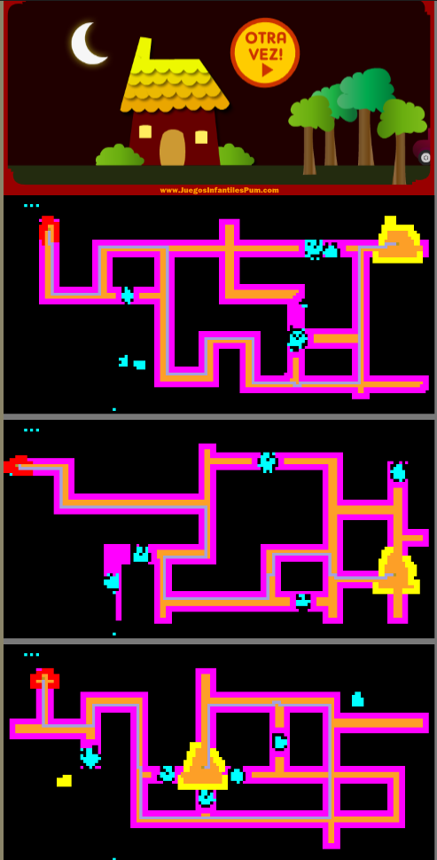

# Maze Analysis

MyAgent analizes the elements contained in a maze from an online kids game and creates a visual in different colors to understand how MyAgent "sees" the maze.

To run go to: https://www.juegosinfantilespum.com/laberintos-online/12-auto-buhos.php and paste the code contained in MyAgent.js into the browsers console, the result will look like this:

(The next step for the implementation of MyAgent would be to create the algorithm that solves the maze and the method to automatically get the car moving until it reaches the house)
