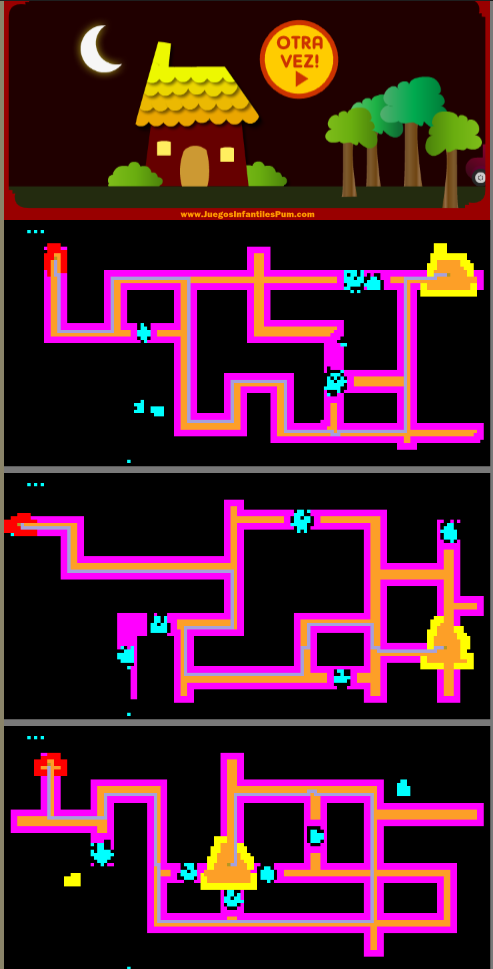

# Maze Solving

MyAgent analizes the elements contained in a maze from an online kids game, creates a visual in different colors to understand how it "sees" and solves the maze automatically getting the car to the house.

To run go to: https://www.juegosinfantilespum.com/laberintos-online/12-auto-buhos.php and paste the code contained in MyAgent.js into the browsers console, the result will look like this after completing the three mazes in the game:

